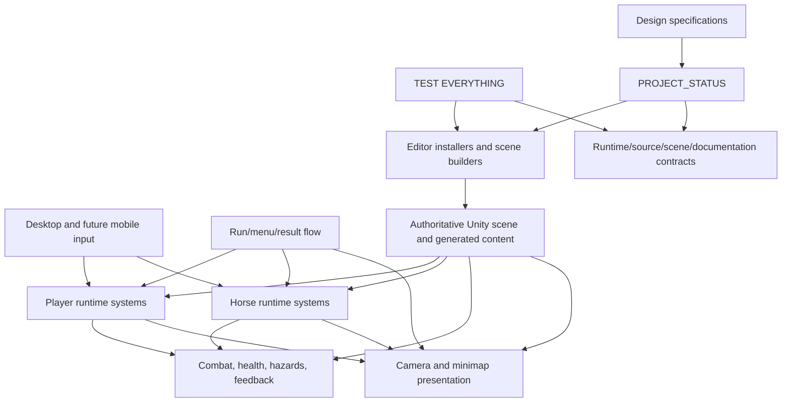
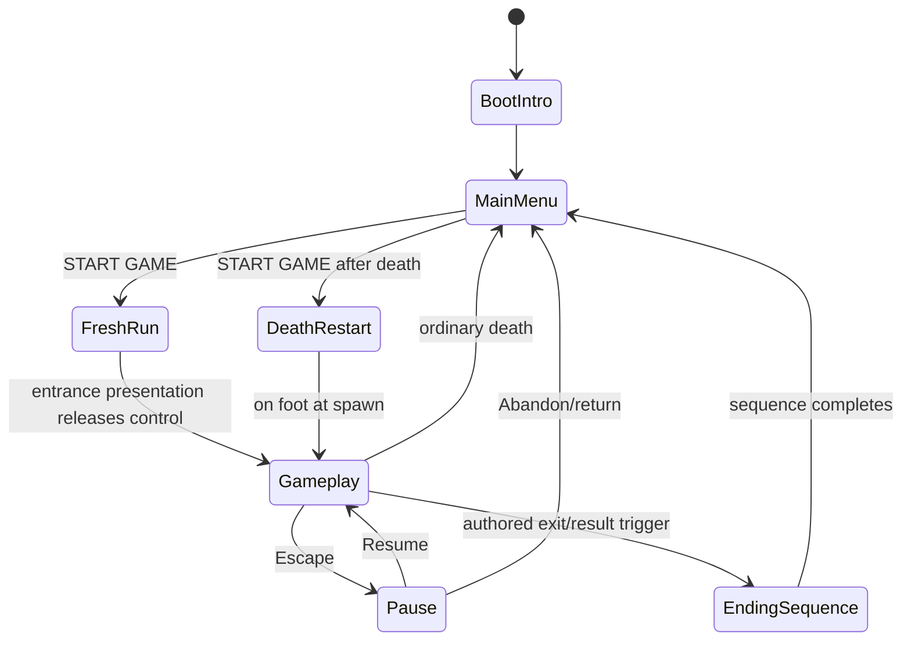

# Architecture — Stable System Map

This document explains durable ownership and integration boundaries. It does not track current task status; `PROJECT_STATUS.md` owns that information.

## High-level layers



## Runtime ownership

### Player and combat

- `BDPlayerController` owns player movement/input-facing runtime behavior.
- Combat behavior is split into dedicated combat components rather than accumulated into menu or scene-builder classes.
- `BDHealth` reports successful player damage to `BDPlayerHazardRecovery` for short combat-grounding protection.
- `BDPlayerHazardRecovery` owns safe-point sampling, ground validation, fall detection, and CharacterController-root-safe recovery placement.

### Horse

- `BDHorseController` owns the real mounted/unmounted state and rider placement contract.
- Horse health, hazard safety, flee behavior, recovery, and interactions remain separate components where practical.
- Cinematic or run-presentation systems call explicit horse APIs rather than duplicating mount state.

### Camera and minimap

- `BDCameraFollow` is the sole normal-gameplay Main Camera transform owner. It owns target selection, yaw, composition, smoothing, shake, collision, and room containment.
- No second Runtime component applies a post-follow camera position offset.
- `BDRunPresentationCoordinator` may temporarily own the camera only during the approved cinematic and then returns ownership to `BDCameraFollow`.
- `BDMazeMinimap` owns map presentation, discovery, cardinal rotation, clipping, and markers; it never repositions gameplay actors or camera.

### Run, menu, pause, and result flow

- `BDMainMenuFlow` remains the single UI owner for main-menu, settings, pause, and loading overlays.
- `BDGameFlowSignals` and completion markers route death/result/cinematic transitions without creating parallel menu controllers.
- Run-presentation components coordinate temporary locks and authored entrance/exit presentation, then release control back to existing gameplay owners.

## Editor ownership

- Runtime code under `Assets/_Project/Scripts/Runtime` does not depend on `UnityEditor`.
- Editor installers/builders under `Assets/_Project/Scripts/Editor` configure authoritative scenes and components.
- Nested installers mark scenes dirty; the top-level QA/install flow owns final saving when documented.
- Unity `.meta` GUIDs remain synchronized.

## QA ownership

There is one required entry point:

```text
Boredom And Dungeons -> TEST EVERYTHING
```

`BDOneClickQAWindow` orchestrates the checks. Domain-specific QA belongs in focused `BD*QA.cs` classes exposing `Scan(BDOneClickQAResult result)` and integrates into the single entry point.

## Run-flow diagram



## Change rules

Update this document when ownership moves, a new major layer appears, scene-generation ownership changes, a persistent data boundary is introduced, a parallel controller is consolidated, or run/menu/result flow changes structurally.

Minor tuning values and current progress remain in design files and `PROJECT_STATUS.md`.
