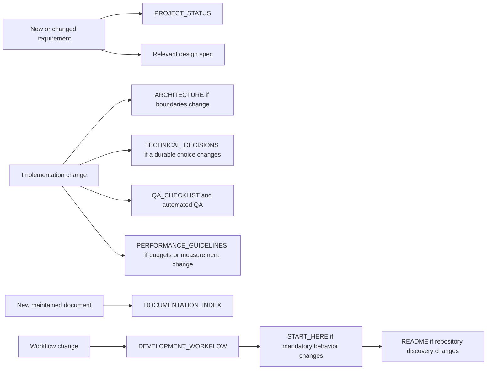

# Documentation Index — Maintained Project Map

This index lists the documents that must remain synchronized. It is a navigation and ownership map, not a second project-status source.

## Mandatory repository documents

| File | Purpose | Update when |
|---|---|---|
| `AGENTS.md` | Canonical project-wide Codex/AI game-development operating contract | AI operating rules, preservation policy, implementation expectations, validation responsibilities, or agent delegation rules change |
| `ART_DIRECTION.md` | Canonical root visual and interface source of truth | Art direction, UI, VFX, models, materials, textures, animation feel, menu shell, iconography, typography, or platform presentation changes |
| `AUDIO_DIRECTION.md` | Canonical root music and audio source of truth | Music states, SFX/ambience relationship, mixer routing, snapshots, stems, vocal stabs, mastering, loudness, or audio QA changes |
| `README.md` | Public orientation and stable repository entry points | Engine/version, repository entry points, primary commands, or stable folder discovery changes |
| `START_HERE.md` | Mandatory first read and permanent operating rules | Mandatory read order, source-of-truth policy, request-classification policy, or repository-hygiene rules change |
| `DEVELOPMENT_WORKFLOW.md` | Authoritative process contract | Packaging, Git handoff, request intake, QA, documentation, repair workflow, cleanup policy, or remote/local synchronization changes |
| `PROJECT_STATUS.md` | Only authoritative requirements/status/order/QA/resume source | Every material user request, implementation, priority, blocker, verification result, synchronization state, or next-step change |
| `DOCUMENTATION_INDEX.md` | Maintained document map | A maintained document is added, removed, renamed, superseded, or changes responsibility |
| `ARCHITECTURE.md` | Stable runtime/editor/data/scene boundaries and flow diagrams | System ownership, dependencies, scene flow, major service/component boundaries, or integration paths change |
| `QA_CHECKLIST.md` | Required verification gates | QA entry points, required automated checks, Play Mode gates, performance gates, repository-hygiene gates, synchronization gates, or release criteria change |
| `TECHNICAL_DECISIONS.md` | Long-lived technical decisions and rationale | A durable architectural or workflow decision is introduced, replaced, or superseded |
| `PERFORMANCE_GUIDELINES.md` | Measurement rules and optimization constraints | Target platforms, budgets, profiling policy, loading strategy, pooling, or performance-sensitive architecture changes |

## Codex project configuration

The following are maintained repository configuration rather than competing
status documents:

- `.codex/config.toml` — project-wide Codex model, reasoning, sandbox, and agent orchestration settings.
- `.codex/agents/*.toml` — specialist agent profiles such as game architecture, gameplay, technical art, performance, and Unity QA.

`AGENTS.md` is the canonical readable contract for these agents. `AGENTS.rtf` is
a local rich-text duplicate, is ignored, and is not a maintained repository file.

## Feature documentation

Feature-specific contracts remain under `Assets/_Project/Design/` and should be grouped by domain, such as:

- `Bosses/`
- `Characters/`
- `Combat/`
- `Horse/`
- `Map/`
- `Movement/`
- `Runtime/`
- `UI/`
- `Visual/`
- `Audio/`
- `Economy/`

A feature document describes durable behavior and acceptance rules. Its current implementation and verification status remains in `PROJECT_STATUS.md`.

### Canonical open-bug ledger

- `Assets/_Project/Design/Runtime/OPEN_BUG_TRACKER.md` — the focused current ledger for every open, reopened, implemented-but-unverified, or disputed defect.
- It is updated in the same change whenever a bug is discovered, changes status, is repaired, is verified, is reopened, or is reclassified.
- It does not own project ordering or the resume point; those remain exclusively in `PROJECT_STATUS.md`.

<!-- B&D TASK CONTINUITY DOCUMENT OWNERSHIP START -->
### Task continuity and active handoff records

- `Assets/_Project/Design/Runtime/TASK_CONTINUITY_AND_HANDOFF_CONTRACT.md` — permanent rule for documenting the reason, scope, decomposition, implementation, evidence, blockers and exact resume point of material tasks.
- `Assets/_Project/Design/Runtime/Tasks/` — active detailed records for large, multi-step, cross-system or multi-session tasks. These records supplement but never replace `PROJECT_STATUS.md` or canonical domain contracts.
- `Assets/_Project/Design/Runtime/Tasks/ARCHITECTURE_GAMEPLAY_CAMERA_AUDIT_V1.md` — current Phase 1 audit record for gameplay, camera, run systems, architecture, QA and documentation; includes rationale, phases, preliminary evidence, retained Play Mode gates and exact continuation point.

Every active task record is updated in the same change as its implementation/verification truth. Before every commit, perform a documentation relevance sweep. When a completed record or any other document no longer has distinct maintained value, merge its durable content into canonical owners, update this index and all references, remove the obsolete file in the same commit, and rely on Git history for the old snapshot.
<!-- B&D TASK CONTINUITY DOCUMENT OWNERSHIP END -->

### Current V23R8 feature contracts

- `Assets/_Project/Design/Runtime/V23R13_AUDIO_QUICKSAND_TARGET_OUTLINE_REPAIR.md` — expanded audio-event coverage, playable quicksand, constant-size silhouette targeting, and compiler-warning cleanup.
- `Assets/_Project/Design/Runtime/V23R12_RUNTIME_REGRESSION_REPAIR.md` — hook movement-root pull, mounted targeting, Parry cleanup, horse prompt placement, root-aware enemy grounding, and integrated Game Boy menu ownership.
- `Assets/_Project/Design/Level/CAMERA_MAP_VISIBILITY_V109.md` — explicit 40/60 normal-gameplay camera composition.
- `Assets/_Project/Design/Horse/HORSE_CONTEXT_ACTION_PROMPTS_V1.md` — exact on-foot, mounted-stationary, and mounted-moving prompt/action matrix.
- `Assets/_Project/Design/Horse/HORSE_EXHAUSTED_FOLLOW_AND_PET_INTERACTION.md` — exhausted follow, pet behavior, and unified prompt integration.
- `Assets/_Project/Design/Combat/GRAPPLING_HOOK_HEAVY_HOLD_V1.md` — strong-button short/hold hook behavior, damage, pull eligibility, and cooldown fallback.
- `Assets/_Project/Design/Combat/AIRBORNE_VERTICAL_ATTACK_PRESENTATION_V1.md` — vertical light/heavy airborne attack presentation.
- `Assets/_Project/Design/Combat/RANGE_AWARE_TARGET_HIGHLIGHT_V1.md` — one-target, in-range, line-of-sight red corner frame.

### Current economy contracts

- `Assets/_Project/Design/Economy/SHOP_AND_CURRENCY_SYSTEM_V1.md` — approved future merchant placement, three-offer weighted stock, partial empty-slot refresh, fixed-cost full reroll, merchant hostility/defeat encounter, run-unique rarity, currency drops, prices, rewards, and acceptance rules.
- `Assets/_Project/Design/Economy/META_PROGRESSION_SYSTEM_V1.md` — required but design-open cross-run points, persistent unlock direction, currency separation, save/UX questions, and future acceptance gate.

### Current cross-system expansion requirements

- `Assets/_Project/Design/Runtime/GAMEPLAY_ABILITIES_MAP_AMBIENT_UI_EXPANSION_HE_V1.md` — authoritative Hebrew source for the approved future expansion covering enemy attack animation timing, player bombs, collectible flutes, shared flute cooldown/input, summoned and ambient creatures, map teleport, jump/dodge animation, living-world effects, menu/HUD polish, performance rules, QA, and mandatory delivery reporting. Status remains required/future/not implemented.

### Current dialogue and cinematic contracts

- `Assets/_Project/Design/Cinematics/OPENING_DIALOGUE_WORDLESS_CHARACTER_VOICE_HE_V1.md` — required future reusable speech-bubble/typewriter/wordless-character-voice system and the exact opening line `I’m bored.`; status is not implemented.

### Current audio-direction contracts

- `AUDIO_DIRECTION.md` — canonical music, complete non-exclusive SFX/event coverage, mixer, mastering, transitions, menu/intro, horse, hazard, and audio QA source.
- `Assets/_Project/Design/Audio/MUSIC_AND_AUDIO_DIRECTION_V1.md` — synchronized Unity-side mirror.

### Current visual-direction contracts

#### Approved modern 3D handheld contract

- `Assets/_Project/Design/UI/MODERN_HANDHELD_3D_ASSET_AND_INTERACTIVE_UI_SPEC_V1.md` — canonical full asset breakdown, 3D hierarchy, screen/glass/material contract, tactile interaction, mouse/D-pad/A/B/X/Y/shortcut input behavior, Main/Pause page requirements, Boy/Girl image-parity rule, target architecture, performance constraints and acceptance gate for the approved upright handheld redesign.
- `Assets/_Project/Design/Visual/References/ModernHandheld3D/REFERENCE_MANIFEST.md` — ownership and usage manifest for the approved front, three-quarter, close-up, Boy and Girl visual references.
- `Assets/_Project/Design/Visual/References/ModernHandheld3D/*.png` — visual direction only; not production textures and not proof of implementation.

- `Assets/_Project/Design/Animation/PRODUCTION_ANIMATION_REQUIREMENTS_V1.md` — mandatory production-animation coverage, timing ownership, root-motion policy, interruption rules, placeholder-debt policy, and release acceptance gate.
- `Assets/_Project/Design/Animation/DEATH_PRESENTATION_V1.md` — player death-before-menu timing, regular-enemy death-before-loot/despawn behavior, and production-animation follow-up.
- `ART_DIRECTION.md` — canonical art direction, 65/35 color/mystery balance, stylized 3D language, materials/textures, lighting, HUD, Game Boy menu shell, typography, iconography, effects, animation feel, horse-prompt visibility, and desktop/mobile adaptation.
- `Assets/_Project/Design/Visual/ART_DIRECTION_AND_INTERFACE_CONVENTIONS_V1.md` — synchronized Unity-side mirror of `ART_DIRECTION.md`.
- `Assets/_Project/Design/Visual/References/BOREDOM_AND_DUNGEONS_ART_DIRECTION_REFERENCE_BOARD_V1.jpg` — compact reference board built from the user-approved images; use for finish, palette, atmosphere, and UI language, never for literal copying.

## Required reading by task type

### Gameplay or feature implementation

1. `AGENTS.md` for Codex/AI assistants
2. `START_HERE.md`
3. `DEVELOPMENT_WORKFLOW.md`
4. `PROJECT_STATUS.md`
5. `ARCHITECTURE.md`
6. relevant `Assets/_Project/Design/**` files
7. `QA_CHECKLIST.md`

### Regression or broken package

1. `START_HERE.md`
2. `DEVELOPMENT_WORKFLOW.md`, especially failure and repair handling
3. exact terminal or Unity error
4. `PROJECT_STATUS.md`
5. affected source, scene, installer, design, and QA files

### Remote/local divergence

1. inspect local `HEAD`, working tree, untracked files, and stored `origin/main`;
2. inspect the actual current remote head and compare it with the local merge base;
3. identify unique remote and local files before any fetch/merge/rebase operation;
4. preserve both sides in a tested merged state; never solve divergence with reset, clean, or broad checkout.

### Music, SFX, ambience, voice, or mixer change

1. `AUDIO_DIRECTION.md`
2. `Assets/_Project/Design/Audio/MUSIC_AND_AUDIO_DIRECTION_V1.md` only as the synchronized Unity-side mirror
3. relevant encounter/feature design files
4. `PROJECT_STATUS.md`
5. `QA_CHECKLIST.md`

### Visual, UI, model, material, texture, VFX, animation, or menu change

1. `ART_DIRECTION.md`
2. `Assets/_Project/Design/Visual/ART_DIRECTION_AND_INTERFACE_CONVENTIONS_V1.md` only as the synchronized Unity-side mirror
3. the reference board when visual comparison is useful
4. relevant feature design files
5. `PROJECT_STATUS.md`
6. `QA_CHECKLIST.md`

### Architecture or performance change

1. `ARCHITECTURE.md`
2. `TECHNICAL_DECISIONS.md`
3. `PERFORMANCE_GUIDELINES.md`
4. `PROJECT_STATUS.md`
5. affected design and QA files

## Documentation synchronization matrix

## Anti-duplication rule

Do not create files such as `WORKING_NOW.md`, `LATEST_STATUS.md`, `PROJECT_STATUS_V2.md`, copied roadmaps, package-version reports, or temporary repair narratives as live sources. Historical states belong in Git history.

## Document lifecycle and retirement

- A maintained file exists only while it has a distinct current responsibility.
- When a document becomes obsolete or is replaced, merge any still-valid requirements into the authoritative owner, update this index, and delete the old file in the same change.
- Do not retain package-version reports, temporary repair narratives, duplicate roadmaps, chat exports, or copied status snapshots as maintained documentation.
- Git history is the archive. The working tree contains current truth only.

### Canonical root Markdown allowlist

- `AGENTS.md`
- `ART_DIRECTION.md`
- `AUDIO_DIRECTION.md`
- `README.md`
- `START_HERE.md`
- `DEVELOPMENT_WORKFLOW.md`
- `PROJECT_STATUS.md`
- `DOCUMENTATION_INDEX.md`
- `ARCHITECTURE.md`
- `QA_CHECKLIST.md`
- `TECHNICAL_DECISIONS.md`
- `PERFORMANCE_GUIDELINES.md`

Any additional root Markdown requires an explicit durable responsibility recorded here. `AGENTS.rtf` is not Markdown and is intentionally ignored as a local duplicate of `AGENTS.md`.

## Current V23R10 feature contracts

- `ART_DIRECTION.md` — canonical root art-direction source.
- `Assets/_Project/Design/Visual/ART_DIRECTION_AND_INTERFACE_CONVENTIONS_V1.md` — synchronized Unity-side mirror.
- `Assets/_Project/Design/UI/GAME_BOY_MENU_AND_UI_OWNERSHIP_V1.md` — menu shell and gameplay-UI visibility ownership.
- `Assets/_Project/Design/Combat/PARRY_SUCCESS_PRESENTATION_V1.md` — anticipation, freeze, and gradual recovery presentation.
- `Assets/_Project/Design/Combat/ENEMY_MOTION_STABILITY_V1.md` — displacement, grounding, jumper, and exceptional-motion contracts.
- `Assets/_Project/Design/Combat/GRAPPLING_HOOK_HEAVY_HOLD_V1.md` — longer/wider safe-release hook.
- `Assets/_Project/Design/Combat/RANGE_AWARE_TARGET_HIGHLIGHT_V1.md` — one truthful ranged target frame.

Art-direction conventions are active; the earlier pending questionnaire state is superseded.

## Current V23R11 contracts

- `AUDIO_DIRECTION.md` — canonical music and audio direction; full runtime music implementation remains under C12.42.
- `Assets/_Project/Design/Audio/MUSIC_AND_AUDIO_DIRECTION_V1.md` — Unity-side mirror.
- `Assets/_Project/Design/Combat/BOMB_EXPLOSION_AND_FRIENDLY_FIRE_V1.md` — visible bomb explosion and enemy friendly fire.
- `Assets/_Project/Design/Combat/AIRBORNE_VERTICAL_ATTACK_PRESENTATION_V1.md` — committed mesh-based vertical light/heavy presentation.

- `Assets/_Project/Design/UI/DAMAGE_NUMBERS_AND_TEST_LABEL_VISIBILITY_V1.md` — player/enemy damage-number colors/animation and occlusion-safe prototype hazard-label rules.

- `Assets/_Project/Design/Combat/MELEE_DAMAGE_SPECTRUM_AND_CRITICALS_V1.md` — sword-only variance, exact 6% critical chance, 1.5 multiplier, fixed ranged/hook exclusions, and critical-number color.

## V23R17 movement/hazard documents

- `Assets/_Project/Design/Hazards/QUICKSAND_AND_ENEMY_HAZARD_BEHAVIOR_V1.md`
- `Assets/_Project/Design/Movement/WALL_JUMP_V1.md`
- `Assets/_Project/Design/Horse/MOUNTED_ENEMY_IMPACT_V1.md`

### Caterpillar gambling NPC

- `Assets/_Project/Design/Economy/CATERPILLAR_GAMBLING_NPC_V1.md` — canonical future requirement for selected-room Caterpillar placement, animated clean-room visibility, one-game assignment, finite bankroll/refill semantics, anti-exploit transactions and enemy-safe gambling sessions. Status: required, not implemented.

### Active professional UI task

- `Assets/_Project/Design/Runtime/Tasks/GAME_BOY_UI_PROFESSIONALIZATION_V1.md` — active task record for additive BBH intro and original modern remembered-handheld menu professionalization; remove after visual verification and durable merge into canonical UI/art documents.

### Master active work sequence

- `Assets/_Project/Design/Runtime/Tasks/MASTER_ACTIVE_WORK_SEQUENCE_V1.md` — canonical ordered execution queue covering blockers, all open bugs, implemented-but-unconfirmed behavior, automated/Play Mode/user verification, next implementation stages and future work. It must remain current across ChatGPT, Codex and developer handoffs.
