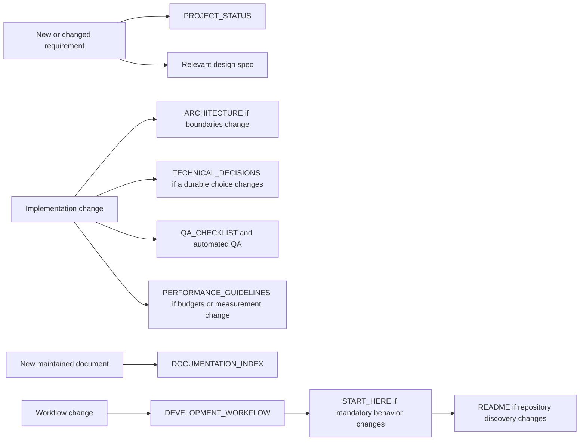

# Documentation Index — Maintained Project Map

This index lists the documents that must remain synchronized. It is a navigation and ownership map, not a second project-status source.

## Mandatory repository documents

| File | Purpose | Update when |
|---|---|---|
| `AGENTS.md` | Canonical project-wide Codex/AI game-development operating contract | AI operating rules, preservation policy, implementation expectations, validation responsibilities, or agent delegation rules change |
| `README.md` | Public orientation and stable repository entry points | Engine/version, repository entry points, primary commands, or stable folder discovery changes |
| `START_HERE.md` | Mandatory first read and permanent operating rules | Mandatory read order, source-of-truth policy, request-classification policy, or repository-hygiene rules change |
| `DEVELOPMENT_WORKFLOW.md` | Authoritative process contract | Packaging, Git handoff, request intake, QA, documentation, repair workflow, cleanup policy, or remote/local synchronization changes |
| `PROJECT_STATUS.md` | Only authoritative requirements/status/order/QA/resume source | Every material user request, implementation, priority, blocker, verification result, synchronization state, or next-step change |
| `DOCUMENTATION_INDEX.md` | Maintained document map | A maintained document is added, removed, renamed, superseded, or changes responsibility |
| `ARCHITECTURE.md` | Stable runtime/editor/data/scene boundaries and flow diagrams | System ownership, dependencies, scene flow, major service/component boundaries, or integration paths change |
| `QA_CHECKLIST.md` | Required verification gates | QA entry points, required automated checks, Play Mode gates, performance gates, repository-hygiene gates, synchronization gates, or release criteria change |
| `TECHNICAL_DECISIONS.md` | Long-lived technical decisions and rationale | A durable architectural or workflow decision is introduced, replaced, or superseded |
| `PERFORMANCE_GUIDELINES.md` | Measurement rules and optimization constraints | Target platforms, budgets, profiling policy, loading strategy, pooling, or performance-sensitive architecture changes |

## Codex project configuration

The following are maintained repository configuration rather than competing
status documents:

- `.codex/config.toml` — project-wide Codex model, reasoning, sandbox, and agent orchestration settings.
- `.codex/agents/*.toml` — specialist agent profiles such as game architecture, gameplay, technical art, performance, and Unity QA.

`AGENTS.md` is the canonical readable contract for these agents. `AGENTS.rtf` is
a local rich-text duplicate, is ignored, and is not a maintained repository file.

## Feature documentation

Feature-specific contracts remain under `Assets/_Project/Design/` and should be grouped by domain, such as:

- `Bosses/`
- `Combat/`
- `Horse/`
- `Map/`
- `Movement/`
- `Runtime/`
- `UI/`

A feature document describes durable behavior and acceptance rules. Its current implementation and verification status remains in `PROJECT_STATUS.md`.

## Required reading by task type

### Gameplay or feature implementation

1. `AGENTS.md` for Codex/AI assistants
2. `START_HERE.md`
3. `DEVELOPMENT_WORKFLOW.md`
4. `PROJECT_STATUS.md`
5. `ARCHITECTURE.md`
6. relevant `Assets/_Project/Design/**` files
7. `QA_CHECKLIST.md`

### Regression or broken package

1. `START_HERE.md`
2. `DEVELOPMENT_WORKFLOW.md`, especially failure and repair handling
3. exact terminal or Unity error
4. `PROJECT_STATUS.md`
5. affected source, scene, installer, design, and QA files

### Remote/local divergence

1. inspect local `HEAD`, working tree, untracked files, and stored `origin/main`;
2. inspect the actual current remote head and compare it with the local merge base;
3. identify unique remote and local files before any fetch/merge/rebase operation;
4. preserve both sides in a tested merged state; never solve divergence with reset, clean, or broad checkout.

### Architecture or performance change

1. `ARCHITECTURE.md`
2. `TECHNICAL_DECISIONS.md`
3. `PERFORMANCE_GUIDELINES.md`
4. `PROJECT_STATUS.md`
5. affected design and QA files

## Documentation synchronization matrix

## Anti-duplication rule

Do not create files such as `WORKING_NOW.md`, `LATEST_STATUS.md`, `PROJECT_STATUS_V2.md`, copied roadmaps, package-version reports, or temporary repair narratives as live sources. Historical states belong in Git history.

## Document lifecycle and retirement

- A maintained file exists only while it has a distinct current responsibility.
- When a document becomes obsolete or is replaced, merge any still-valid requirements into the authoritative owner, update this index, and delete the old file in the same change.
- Do not retain package-version reports, temporary repair narratives, duplicate roadmaps, chat exports, or copied status snapshots as maintained documentation.
- Git history is the archive. The working tree contains current truth only.

### Canonical root Markdown allowlist

- `AGENTS.md`
- `README.md`
- `START_HERE.md`
- `DEVELOPMENT_WORKFLOW.md`
- `PROJECT_STATUS.md`
- `DOCUMENTATION_INDEX.md`
- `ARCHITECTURE.md`
- `QA_CHECKLIST.md`
- `TECHNICAL_DECISIONS.md`
- `PERFORMANCE_GUIDELINES.md`

Any additional root Markdown requires an explicit durable responsibility recorded here. `AGENTS.rtf` is not Markdown and is intentionally ignored as a local duplicate of `AGENTS.md`.
