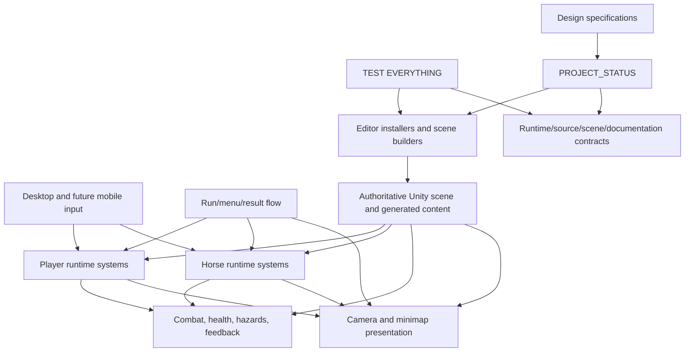
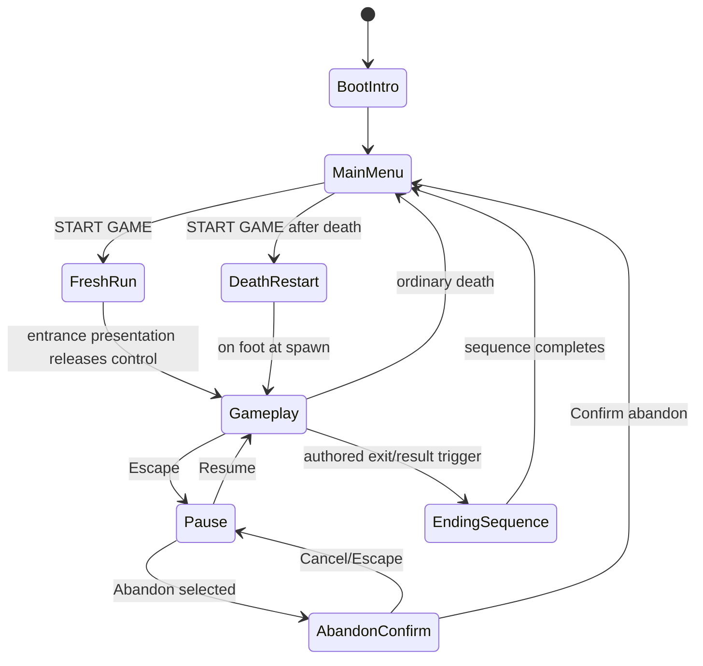
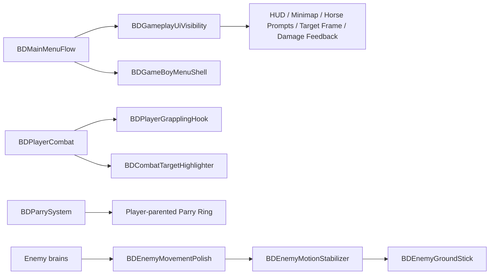
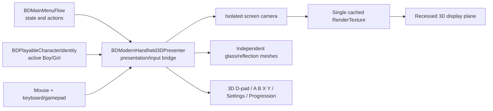

## Handheld live-screen reliability

## Modern handheld V4 presentation ownership

- `BDModernHandheld3DPresenter` owns generated physical geometry, screen RenderTexture, hardware interaction, contextual art, product-shot shadow layers and glass presentation.
- `BDMainMenuFlow` remains the semantic state/action owner; V4 does not duplicate navigation decisions.
- The shell is a real mesh/material system. A full-face transparent image is forbidden as a Runtime geometry substitute.
- The supplied texture sheet remains a visual/source reference; production Runtime uses the shell micro-surface texture and generated geometry.
- The New Game memory card is a selection-dependent view only and has no gameplay/state authority.


## Handheld artwork ownership

`BDModernHandheld3DPresenter.ResolveContextArtwork` is the single presentation resolver for menu imagery. It derives artwork from the displayed page and selected semantic row. `BDPlayableCharacterIdentity` is consulted only for Main Menu Start Game / New Run. No other page may branch on character identity. This avoids duplicated neutral art and prevents unrelated pages from inheriting New Game imagery.

The internal menu Canvas uses `RenderMode.ScreenSpaceCamera` at the exact RenderTexture resolution. This avoids world-space orientation/scale drift and guarantees deterministic rasterization into the physical display. The screen camera renders before the product camera consumes the texture, and page rebuilds request one immediate render. Physical button meshes remain visual/tactile parts; separate invisible hit targets own pointer reliability and forward actions to the existing menu authority.

# Architecture — Stable System Map

## Modern handheld screen UI dependency

`BDModernHandheld3DPresenter` owns only presentation and input translation. Its internal live screen is a ScreenSpaceCamera uGUI Canvas (`com.unity.ugui` `2.0.0`) captured by one isolated screen camera into one cached RenderTexture. `BDMainMenuFlow` remains the semantic page/action authority; the presenter must not duplicate run, settings, progression or pause state.

This document explains durable ownership and integration boundaries. It does not track current task status; `ProjectGuide/Status/CURRENT.md` owns that information.

## Production animation ownership

Gameplay systems own state, movement, damage, cooldowns and authoritative timing. Animation presents those states and synchronizes authored contact moments without becoming a second gameplay owner. Every action requiring visible motion must graduate from prototype posing to the production requirements in `ProjectGuide/Features/Animation/PRODUCTION_ANIMATION_REQUIREMENTS_V1.md`.

## Horse hazard damage and recovery ownership

`BDHorseHazardSafety` owns horse hazard damage and horse relocation. `BDPlayerHazardRecovery` owns rider fall/lava presentation and rider relocation.

- Unmounted hole/chasm: the horse receives the configured fall damage and teleports to its latest legal safe point.
- Mounted hole/chasm: the hazard-specific forced dismount occurs before horse damage callbacks and before either actor relocates; the horse then receives fall damage and the rider separately receives the configured player fall damage and recovery.
- Unmounted lava: the horse receives lava damage and teleports to its latest legal safe point.
- Mounted lava: the hazard-specific forced dismount occurs before horse damage callbacks and before either actor relocates; the horse receives lava damage instead of the rider, and the rider follows a zero-damage lava recovery arc to a separated safe point beside the recovered horse.

## High-level layers



## Runtime ownership

### Player and combat

- `BDPlayerController` owns player movement/input-facing runtime behavior.
- `BDPlayerCombat` remains the input, cooldown, ammo, and committed attack owner. Heavy-hold grappling input is resolved there so short press, long hold, independent hook cooldown, and normal-heavy fallback cannot double-fire.
- `BDPlayerGrapplingHook` is a short-lived attack presentation/pull transaction. It applies exactly one 2-damage hit, may move only eligible small regular enemies, and never becomes a persistent enemy movement owner.
- Mounted-combat permissions are character-specific. The current Boy profile is ranged-only while mounted and cannot launch sword melee or the grappling hook. The future Girl profile may opt into mounted hook/attack capability without globally enabling it for every player character.
- For the current Boy, mounted Light/Heavy input is blocked and cannot launch sword melee or the grappling hook. A future Girl capability may enable approved mounted attacks through character-specific data.
- `BDPlayerMeleeEnhancer` resolves buffered attack identity, airborne state, body animation and landing-damage adjustment. `BDPlayerCombat` consumes the returned airborne identity at the committed hit and chooses exactly one visual branch: `SpawnVertical` for airborne or the normal grounded arc otherwise. Timing-based suppression is not the active ownership model.
- `BDBombHazard` owns one explosion transaction. `BDBombExplosionVisual` owns temporary explosion presentation; enemy friendly fire is unique per `BDHealth`, excludes the bomb owner, and reuses established stagger/knockback/grounding owners.
- `BDCombatTargetHighlighter` is presentation only: it reads the current attack envelope, selects at most one unobstructed in-range enemy, and delegates a constant-pixel red mesh-silhouette outline to `BDTargetOutlineVisual` without damage, movement, lock-on, camera, or source-material ownership.
- Combat behavior is split into dedicated combat components rather than accumulated into menu or scene-builder classes.
- `BDHealth` reports successful player damage to `BDPlayerHazardRecovery` for short combat-grounding protection.
- `BDDamageNumberFeedback` is short-lived world-space presentation dispatched only after `BDHealth` applies real damage. It distinguishes player/enemy colors and never owns health, hit validation, cooldowns, or combat state.
- `BDPlayerCombat.ResolveSwordAttackBaseDamage` owns sword-spectrum variance and `ApplySwordCriticalRoll` owns the exact 6%/1.5 critical rule. Light, heavy, and airborne attacks resolve both once per committed attack. Spinning AOE resolves one shared spectrum before iteration and one independent critical per unique enemy inside the target loop. Ranged and hook paths bypass both. `BDHealth.ApplyPlayerSwordDamage` carries only the critical presentation flag while `BDHealth` remains the damage authority.
- `BDPrototypeHazardLabelVisibility` owns distance/line-of-sight visibility for generated first-room test labels. Hazard behavior remains owned by `BDHazardVolume`; labels cannot reveal adjacent rooms through walls.
- `BDPlayerHazardRecovery` owns safe-point sampling, ground validation, fall detection, and CharacterController-root-safe recovery placement.
- `BDCharacterDeathAnimation` owns the temporary player/enemy death pose. `BDMainMenuFlow` delays the player menu transition until the player pose completes; regular enemy owners delay loot/despawn until their death pose completes.

### Collectible guardian activation and forced-movement classification

- `BDCollectibleGuardianSpawner` constructs each guardian root inactive with its complete health, collider, AI, grounding, tactical, and combat-profile stack, then activates the root atomically at the final legal spawn point.
- `BDCombatantProfile` owns durable forced-movement eligibility. Battery guardians use the `Elite` rank: player attacks still damage them, but hook pull, knockback, mounted impact, and small-enemy hazard forcing cannot move them.
- `BDPlayerGrapplingHook` commits a pull only for the canonical small-regular category and resolves stagger/knockback on the real movement root.

### Horse

- `BDHorseController` owns the real mounted/unmounted state, rider placement, mounted motion, smoothed mouse-facing direction, and legal action-state contract.
- Mounted forward travel and visible horse turning consume the same rate-limited aim direction; UI or camera components do not calculate an independent movement heading.
- `BDHorseContextActionPrompts` is the single horse prompt presenter. On foot it may show Mount, conditional Heal, and Pet; mounted and stationary it shows only Dismount; mounted and moving it shows no row. It reads state and never performs gameplay actions itself.
- Legacy standalone Heal/Pet indicators suppress themselves while the unified presenter exists. Horse healing is on-foot only. Mounted stationary Pet remains key-usable without a prompt and is disabled as soon as the horse moves.
- Horse health, hazard safety, flee behavior, recovery, and interactions remain separate components where practical.
- Cinematic or run-presentation systems call explicit horse APIs rather than duplicating mount state.

### Visual language and interface

- `ProjectGuide/Product/ART_DIRECTION.md` owns the durable visual language for stylized 3D form, materials, textures, color, lighting, HUD, prompts, typography, iconography, effects, animation feel, and responsive desktop/mobile presentation.
- Menus are planned inside an original Game Boy-like in-world shell. The shell is presentation only; `BDMainMenuFlow` retains menu state and navigation ownership.
- True victory over Mother may persistently transform the shell, boot treatment, and palette without replacing settings, accessibility, or flow ownership.
- The visual reference board guides finish and atmosphere but is not permission to copy branded layouts.

### Music and audio

- Root `ProjectGuide/Product/AUDIO_DIRECTION.md` owns music identity, state hierarchy, mixer routing, loudness/mastering, and transition rules.
- Full runtime implementation remains under `C12.42`: one `BDMusicDirector`, explicit `AudioMixer` groups/snapshots, synchronized stems, and persistent settings routing.
- `BDGameFeelAudio` remains a lightweight current SFX generator and does not become the future adaptive-music owner.
- Mother phase 4 tick-tock is a synchronized Music stem, not an unrelated one-shot SFX.

### V23R12 runtime-repair ownership

- Hook transactions resolve a target's real movement root; `BDHealth` remains damage ownership and is not assumed to own locomotion.
- `BDGrapplingHookPullState` is the short contact-suppression authority after a pull; enemy archetypes query it before contact/melee/landing damage.
- `BDEnemyPlacementGuard` owns pre-visibility spawn correction. `BDEnemyGroundStick` owns ordinary vertical grounding. `BDEnemyMotionStabilizer` guards impossible displacement and accepts explicit baselines after legal corrections.
- Horizontal relocation is never a continuous combat-time safety behavior.
- Mounted target highlighting reads `BDPlayerCombat.TargetHighlightOrigin` and the ranged envelope without taking combat-input ownership.
- `BDMeleeSlashArcVisual.ClearAllActive` is the cleanup boundary for Parry and non-gameplay menu/death transitions.
- `BDMainMenuFlow` is the only menu GUI owner; `BDGameBoyMenuShell` draws integrated decoration within that pass and has no independent `OnGUI`.

### Camera and minimap

- `BDCameraFollow` is the sole normal-gameplay Main Camera transform owner. It owns target selection, yaw, explicit viewport composition, smoothing, shake, collision, and room containment.
- The normal target is composed at viewport Y `0.40`, leaving approximately 60% of visible space ahead. Runtime migration bounds legacy serialized pitch values so old scene data cannot silently return the player/horse to screen center.
- Stable room bounds are the primary normal-gameplay camera constraint. Wall casts are reserved for active room handoffs, constrained look-point smoothing is independent from camera-body containment, and room discovery is cached/resolved no more than once per frame.
- No second Runtime component applies a post-follow camera position offset.
- `BDRunPresentationCoordinator` may temporarily own the camera only during the approved cinematic. For fresh/victory mounted starts it primes that ownership synchronously from `sceneLoaded` before the first rendered gameplay frame, then returns ownership to `BDCameraFollow` only after the approved stop and camera-return sequence.
- `BDMazeMinimap` owns map presentation, discovery, cardinal rotation, clipping, and markers; it never repositions gameplay actors or camera.

### Run, menu, pause, and result flow

- `BDMainMenuFlow` remains the single UI owner for main-menu, settings, pause, abandon-confirmation, and loading overlays.
- Confirmed abandon reloads the active scene into a clean main-menu state before presenting the menu. It never reuses the abandoned live run as a menu background.
- `BDGameFlowSignals` and completion markers route death/result/cinematic transitions without creating parallel menu controllers.
- Run-presentation components coordinate temporary locks and authored entrance/exit presentation, then release control back to existing gameplay owners.
- `BDRunPresentationCoordinator` resolves the active loaded-scene player and horse deterministically before a mounted intro; abandon/reload cannot reuse an inactive or stale rider reference. `BDHorseController.MoveByExternalControl` also snaps the unparented rider after every cinematic horse move because the normal horse `Update` is disabled during presentation.
- `BDQuicksandStatus` pushes one movement multiplier to `BDPlayerController`, which applies it exactly once through `EffectiveMoveSpeed`.
- `BDPlayerHazardRecovery` ignores combat-grounding recovery during an authoritative controlled jump so enemy contact cannot teleport the player backward.

## Editor ownership

- Runtime code under `Assets/_Project/Scripts/Runtime` does not depend on `UnityEditor`.
- Editor installers/builders under `Assets/_Project/Scripts/Editor` configure authoritative scenes and components.
- Nested installers mark scenes dirty; the top-level QA/install flow owns final saving when documented.
- `BDCollectibleGuardianSpawner` owns encounter eligibility and complete inactive guardian construction; `BDGuardianSpawnSequence` owns delayed activation independently from the collectible object's lifetime.
- Unity `.meta` GUIDs remain synchronized.

## QA ownership

There is one required entry point:

```text
Boredom And Dungeons -> TEST EVERYTHING
```

`BDOneClickQAWindow` orchestrates the checks. Domain-specific QA belongs in focused `BD*QA.cs` classes exposing `Scan(BDOneClickQAResult result)` and integrates into the single entry point.

## Run-flow diagram



## Change rules

Update this document when ownership moves, a new major layer appears, scene-generation ownership changes, a persistent data boundary is introduced, a parallel controller is consolidated, or run/menu/result flow changes structurally.

Minor tuning values and current progress remain in design files and `ProjectGuide/Status/CURRENT.md`.

## V23R10 gameplay presentation ownership



The menu flow owns whether gameplay presentation is visible. The shell is presentation-only. Enemy stabilization corrects invalid displacement and grounding without becoming a second AI decision owner.

## V23R13 quicksand and silhouette targeting

- `BDQuicksandStatus` is the single progressive quicksand state owner for player and horse actors. `BDHazardVolume` only reports contact; controllers consume the status movement multiplier; existing player/horse hazard recovery owns full-submerge recovery.
- Quicksand is unsafe for safe-point selection and horse path safety, but unlike hole/lava it does not recover on first contact.
- `BDCombatTargetHighlighter` remains the single target resolver. `BDTargetOutlineVisual` owns only presentation and renders a constant-pixel inverted hull through `BDTargetSilhouetteOutline.shader`; it cannot select, move, damage, or lock a target.
- `ProjectGuide/Product/AUDIO_DIRECTION.md` is the canonical event-coverage and mix contract; complete runtime production remains C12.42.

## V23R17 movement and hazard ownership

- `BDPlayerController` owns grounded jump, recent-wall contact, and wall-jump launch state.
- `BDQuicksandStatus` owns sink depth, progressive movement multiplier, per-second player damage, jump extraction, dodge pause, and player/horse/enemy sink outcomes.
- `BDEnemyHazardNavigation` filters authored enemy brain motion before `CharacterController.Move`; `BDKnockbackReceiver` explicitly opens forced-entry windows.
- `BDHazardVolume` remains the registered hazard geometry and final enemy outcome authority.
- `BDHorseImpactAttack` owns mounted small-enemy collision damage and knockback; `BDHorseController` exposes read-only mounted speed/direction.

## V23R19 movement and attack-presentation ownership

- `BDQuicksandStatus` owns active/residual quicksand state and prevents generic `BDPlayerHazardRecovery` floor-loss recovery until it releases ownership or deliberately requests failure recovery.
- `BDPlayerController` owns controlled jump reach, dodge distance and solid vertical wall-jump surface resolution; the bounded probe runs only when Jump is requested while airborne.
- `BDPlayerMeleeEnhancer` resolves committed airborne identity and body motion; `BDPlayerCombat` owns the single explicit vertical-versus-horizontal slash branch.

## V23R19O focused ownership clarification

- `BDRunPresentationCoordinator` temporarily owns mounted-intro rider-renderer visibility and skinned offscreen-update policy while it owns cinematic camera/control. `BDHorseController` continues to own rider Transform placement and calls the coordinator's visibility reassertion from its authoritative mounted-intro binding.
- `BDTargetOutlineVisual` outlines only eligible visible geometry intersecting the selected `BDHealth` damageable non-trigger collider envelope.
- `BDAuxiliaryEnemyRingTransparency` owns the reduced alpha of broad flat enemy support rings. Those rings remain presentation-only and are excluded from outline geometry.
- `BDPlayerController` owns Wall Jump impulse, retained speed, bounded air steering and trajectory-facing intent.
- `BDCameraFollow` remains the sole gameplay camera writer and only accelerates yaw response while consuming the player's active Wall Jump direction.

## Future Caterpillar gambling NPC ownership

When implemented:

- run/room content placement owns which rooms are Caterpillar-eligible;
- room encounter state owns clear/unsafe notifications;
- the Caterpillar presentation state machine owns animated appearance, visible idle, interaction and disappearance;
- the gambling-session coordinator owns one active transaction, temporary player-safety state and deterministic cleanup;
- individual game modules own game-specific rules and presentation through a configurable game interface;
- the Caterpillar bankroll owner applies atomic stake/payout/refill mutations and anti-duplication guards;
- no enemy archetype receives ad-hoc Caterpillar exceptions; enemies consume one explicit session-safety/room-access policy.

## V23R19Q professional menu ownership

- `BDBBHBootIntro` remains the sole BBH boot owner and now also owns its cached screen-surface textures.
- `BDDreamyMainMenuBackdrop` remains the menu-world backdrop owner.
- `BDGameBoyMenuShell` owns the physical handheld body, screen housing, glass overlay, controls and persistent original/awakened palette.
- `BDMainMenuFlow` owns screen content, interaction, mode transitions and menu behavior.
- Shell and content remain in one ordered IMGUI composition; no second competing menu canvas or OnGUI owner is introduced.

<!-- B&D MODERN 3D HANDHELD TARGET ARCHITECTURE START -->
## Implemented rollout architecture — upright 3D handheld

The approved final menu presentation requires a real 3D device while preserving one semantic menu owner.

- `BDMainMenuFlow` remains the sole state, focus, input-semantic, mode-transition, settings/progression, pause/resume and abandon owner.
- The existing shell responsibility evolves into one presentation-only 3D handheld presenter. It owns the prefab, device camera, body/glass/display materials, physical hit targets, tactile button transforms and original/awakened palette.
- A menu-screen view renders content onto the physical display, preferably through one dedicated Canvas/UI camera and one RenderTexture displayed behind the glass.
- The screen view submits semantic commands to `BDMainMenuFlow`; it does not own navigation state.
- One input adapter merges pointer, keyboard/controller and physical-device hit targets into Navigate/Confirm/Back/OpenSettings/OpenProgression commands.
- Main, Settings, Progression, Pause, Abandon and Loading reuse the same device instance/system.
- Runtime character identity selects the matched Boy/Girl pair only for Start Game / New Run; every other option/page resolves a dedicated character-neutral image.
- The presenter now exists as an additive rollout path. Legacy IMGUI remains a fallback only and is suppressed while the 3D presenter visibly owns the menu.
<!-- B&D MODERN 3D HANDHELD TARGET ARCHITECTURE END -->

## Modern 3D handheld menu architecture



Ownership rules:

- `BDMainMenuFlow` continues to own Main/Pause/Settings/Progression/Abandon/Loading state and run transitions.
- `BDModernHandheld3DPresenter` owns only 3D construction, screen composition, focus, pointer raycasts, hardware-style input translation and tactile presentation.
- The presenter never becomes a gameplay movement, combat, health, save or scene-flow owner.
- The screen uses one camera and one cached RenderTexture per presenter.
- The device camera renders only the dedicated device layer; screen content renders only the isolated screen layer.
- `BDPlayableCharacterIdentity` is consulted only for the Start Game / New Run preview pair. Active Boy selects Boy art and active Girl selects Girl art; saved preference is fallback only when no active identity exists. All other artwork bypasses character identity and resolves from shared neutral assets.
- Legacy IMGUI/backdrop remain fallback paths and are suppressed only while the new presenter is visible.
- The device view uses isolated unnamed layers `29` (physical product scene) and `30` (screen Canvas) rather than the built-in UI layer, preventing unrelated UI colliders/renderers from entering device raycasts.
- The uploaded orthographic front artwork is a visual/source reference only. Runtime uses a molded shell material and independent live display/tactile control geometry; no full-face decal is rendered.
- The table environment uses the uploaded wood source and one material blending matching sharp/defocused textures around a configurable focal band. Device, table and shadows share the same rest transform/contact plane.
- Each D-pad direction owns a separate moving cap and hit target; no four-way component competes over one transform.
