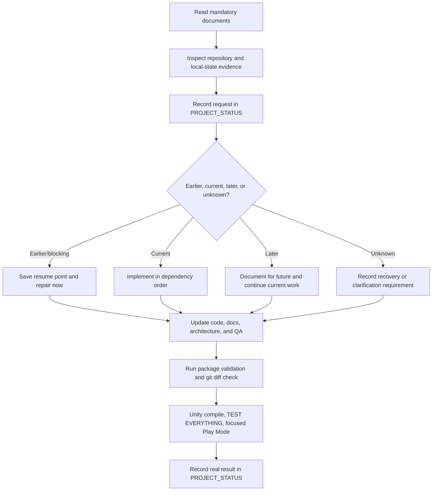

# START HERE — Mandatory First Read

This file is the permanent repository entry point. `AGENTS.md` is the canonical
project-wide operating contract that Codex and other AI assistants read before
this file. The maintained `.codex/` directory contains project configuration and
specialist agent profiles; it does not replace the product status or workflow
documents.

## Required reading order

Before proposing, editing, generating, or validating a material change, read these files in order:

1. `AGENTS.md` — mandatory project-wide Codex/AI operating contract.
2. `START_HERE.md` — repository entry point and non-negotiable rules.
3. `DEVELOPMENT_WORKFLOW.md` — authoritative working method.
4. `PROJECT_STATUS.md` — only authoritative source for requirements, ordering, current state, QA truth, blockers, and the exact resume point.
5. `DOCUMENTATION_INDEX.md` — map of maintained documentation and update responsibilities.
6. `ARCHITECTURE.md` — stable system boundaries and integration map.
7. `QA_CHECKLIST.md` — validation and release gates.
8. `ART_DIRECTION.md` — canonical root visual language for art, UI, effects, materials, icons, typography, menus, and presentation work.
9. `AUDIO_DIRECTION.md` — canonical root music, SFX, ambience, mixer, mastering, and transition language.
10. The synchronized Unity-side mirror relevant to the task (`Assets/_Project/Design/Visual/` or `Assets/_Project/Design/Audio/`).
11. The design/specification files relevant to the requested feature.

`README.md` is the public orientation page. It points here and must not become a competing status document.

## Permanent user-request capture rule

Every new user request must be recorded in the correct logical place in `PROJECT_STATUS.md` before implementation or in the same change package as implementation. A request must never remain only in chat.

Classify every request before implementation:

- **Earlier/blocking:** regression, compilation failure, broken QA, data loss risk, repository corruption, documentation/workflow failure, or prerequisite missing from the current work. Record it, preserve the current resume point, implement and verify it immediately, then return to the saved work.
- **Current:** belongs to the active category or feature. Record it and implement it now in dependency order.
- **Later:** belongs to a future category and does not block current work. Record it in the correct future location and continue the current work.
- **Unknown:** record it as requiring clarification or recovery. Do not invent missing requirements.

This is a standing instruction. The user does not need to explain or repeat it in later conversations.

## Non-destructive repository rule

- Preserve existing code, scenes, prefabs, assets, materials, animation, audio, documentation, colors, and behavior by default.
- Do not use destructive `reset`, `clean`, broad checkout, or deletion to solve a partial installation.
- Repair the actual partial local state and preserve unrelated local work.
- Do not create a second implementation when an existing owner/system can be extended.
- Do not claim Unity compilation, Play Mode, performance, or QA success unless it was actually run.
- Keep `Assets/_Project/Design/Runtime/OPEN_BUG_TRACKER.md` synchronized on every bug discovery, status change, repair, verification, reopening, or reclassification.

## Sources of truth

| Subject | Authoritative file |
|---|---|
| Codex/AI project-wide operating contract | `AGENTS.md` |
| Codex project configuration and specialist profiles | `.codex/config.toml`, `.codex/agents/*.toml` |
| Requirements, ordering, current/next work, blockers, QA truth | `PROJECT_STATUS.md` |
| How work is performed and delivered | `DEVELOPMENT_WORKFLOW.md` |
| Documentation map and maintenance ownership | `DOCUMENTATION_INDEX.md` |
| Stable system boundaries and diagrams | `ARCHITECTURE.md` |
| Verification gates | `QA_CHECKLIST.md` |
| Long-lived technical choices | `TECHNICAL_DECISIONS.md` |
| Performance measurement rules | `PERFORMANCE_GUIDELINES.md` |
| Art direction, UI language, effects, materials, typography, icons, and Game Boy menu conventions | `ART_DIRECTION.md` (canonical root), mirrored at `Assets/_Project/Design/Visual/ART_DIRECTION_AND_INTERFACE_CONVENTIONS_V1.md` |
| Music states, ambience, SFX relationship, AudioMixer routing, snapshots, mastering, stems, and audio QA | `AUDIO_DIRECTION.md` (canonical root), mirrored at `Assets/_Project/Design/Audio/MUSIC_AND_AUDIO_DIRECTION_V1.md` |

Git history stores previous versions. Do not create competing live status files.

## Standard change path

## Permanent current-document and repository-hygiene rule

Git must always contain the current, accurate project truth. Every material request, correction, implementation, QA result, blocker, and resume-point change is synchronized into the maintained repository documents in the same change.

- Do not leave material requirements only in chat, a downloaded TXT, a package README, or an untracked local note.
- Do not keep obsolete roadmaps, superseded repair reports, duplicate status files, temporary package documents, or stale instructions as live repository documentation.
- Before removing a superseded document, merge every still-valid requirement into its authoritative owner and update `DOCUMENTATION_INDEX.md`.
- Use Git history for old versions. Maintained files describe current truth.
- `AGENTS.md` is canonical root Markdown; `.codex/` is maintained project configuration.
- `AGENTS.rtf` is only a local rich-text duplicate and must remain ignored/untracked.
- Run repository-hygiene checks on every handoff and before every commit.
- When the user explicitly requests a direct Git update, the assistant may update the repository directly; otherwise follow the normal reviewed local verification/commit flow.
